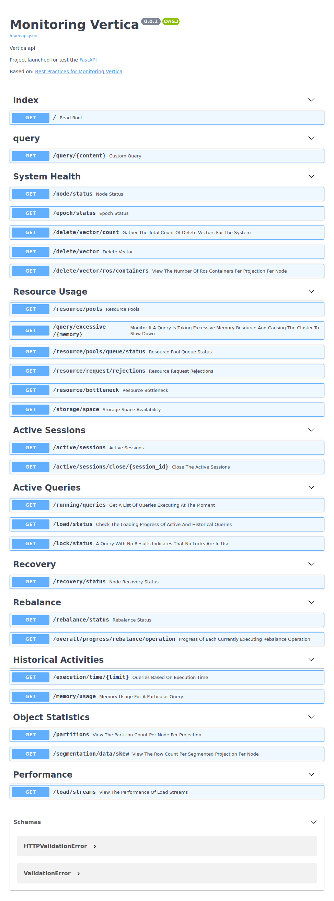
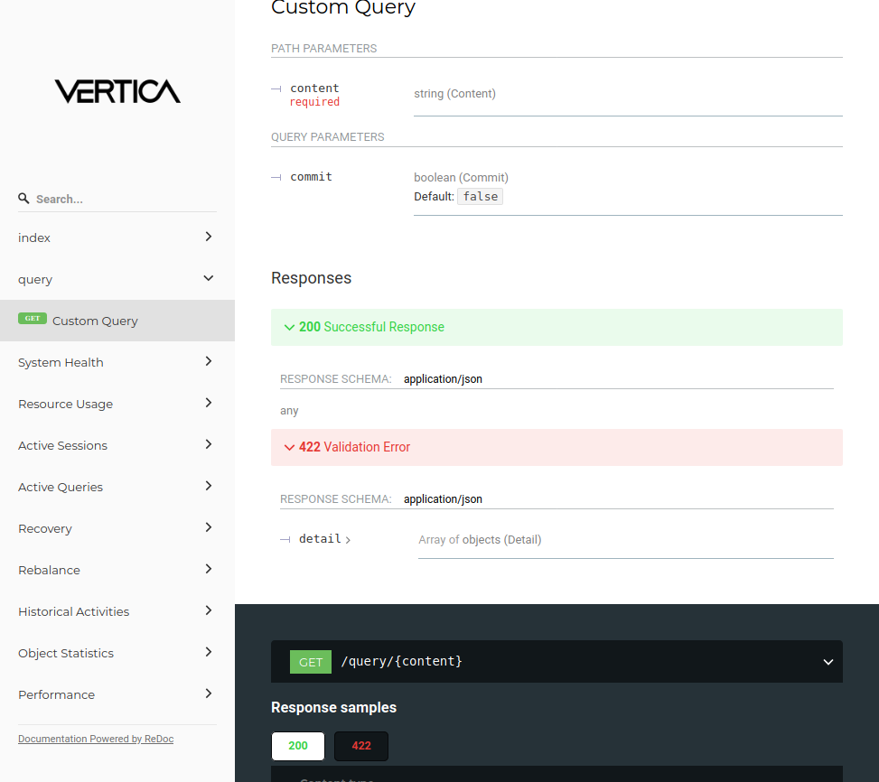

# Monitoring Vertica

Python version
--------------

Tested with Python 3.7

This project was made for test FastApi.

The API endpoint use queries (**bonus a custom query with commit**) and techniques from [`vertica`](https://www.vertica.com/kb/Best-Practices-for-Monitoring-Vertica/Content/BestPractices/BestPracticesforMonitoringVertica.htm) for monitoring the following areas of your database:

    System health
    Resource usage
    Active sessions
    Active transactions
    Recovery
    Rebalance
    Historical activities
    Object statistics
    Query performance
    Monitor DC tables

Install with venv:

1- create venv:

    python3 -m venv monvertica
    
2- activate venv:

    source monvertica/bin/activate
    
3- install requirements:

    pip install -r requirements.txt
    
4- start uvicorn:

    ./start.sh

5- open your browser:

    Swagger - http://127.0.0.1:8000/docs
    ReDoc - http://127.0.0.1:8000/redoc

## Docs

* Swagger
* ReDoc

## Ressources

* Logo vertica on ReDoc from wikipedia
* Logo & js Swagger from jsdelivr
* Logo & js ReDoc from jsdelivr

## Requirements

* fastapi==0.58.1
* uvicorn==0.11.5
* vertica-python==0.10.4

## Meta

Lucian – [@odgon](https://twitter.com/odgon)

Distributed under the MIT license. See ``LICENSE`` for more information.

[monitoring-vertica](https://github.com/odgon/monitoring-vertica)